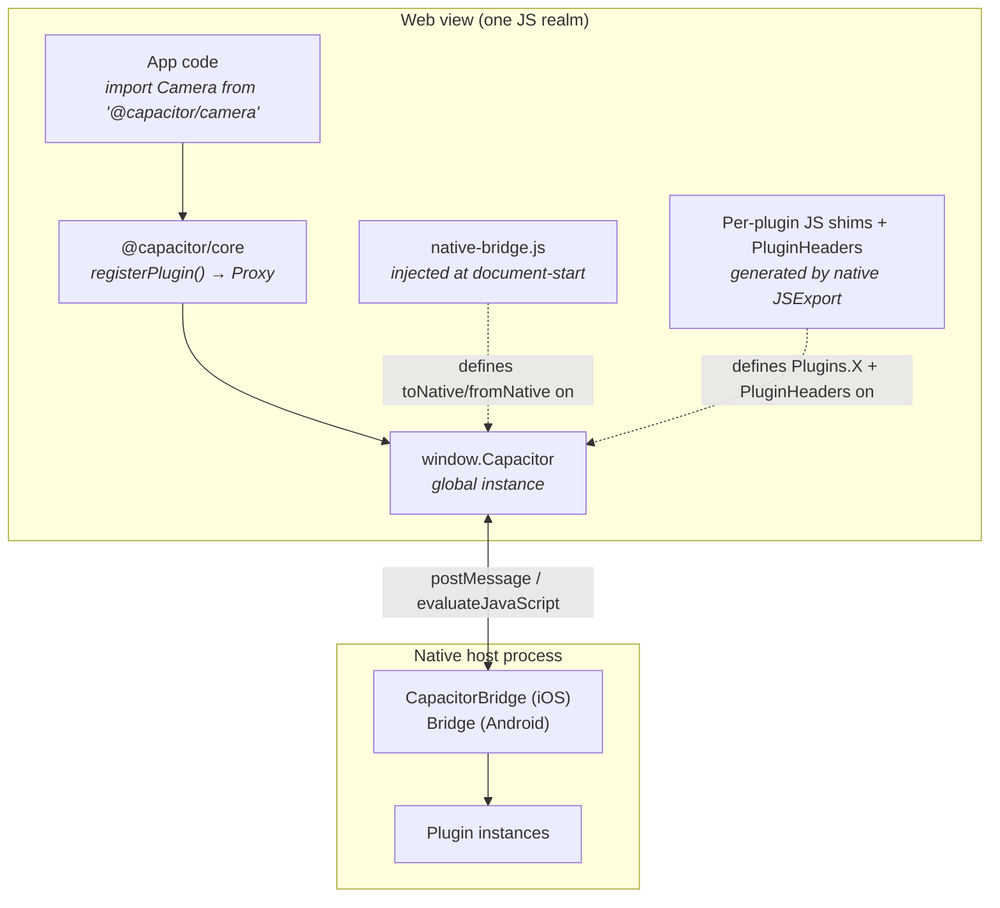
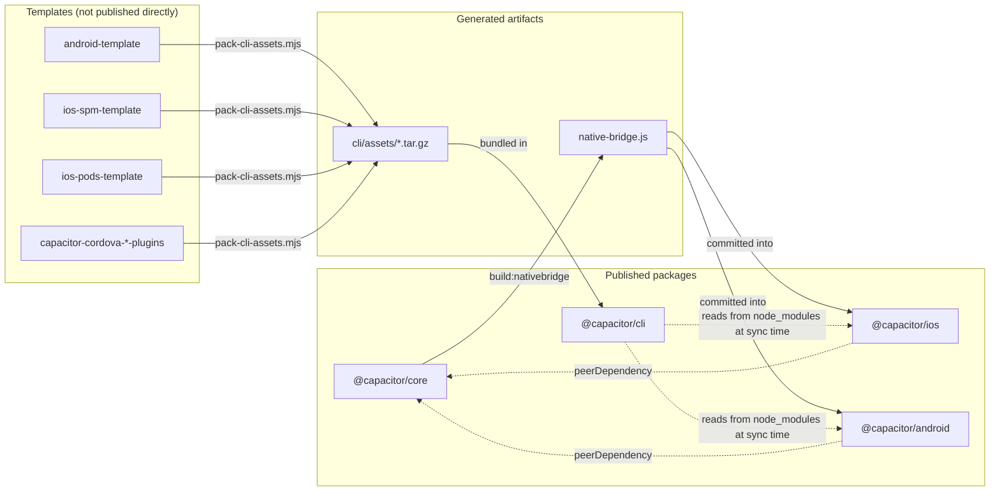
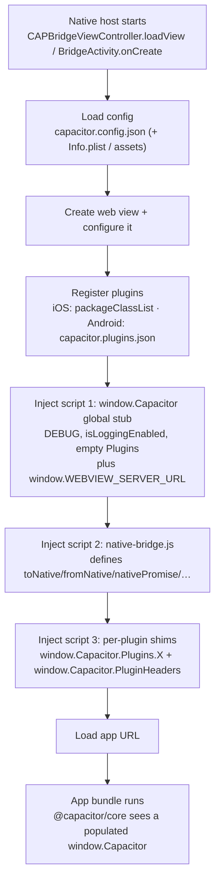
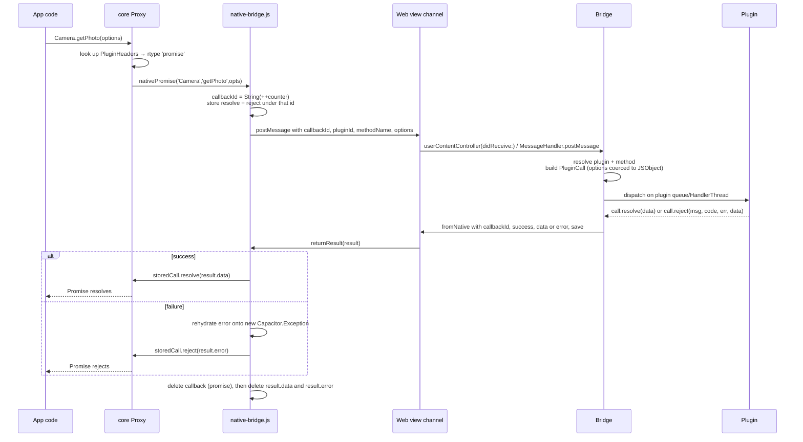
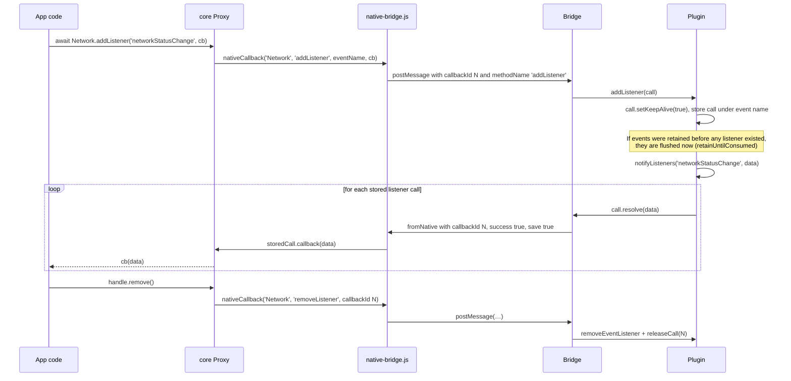
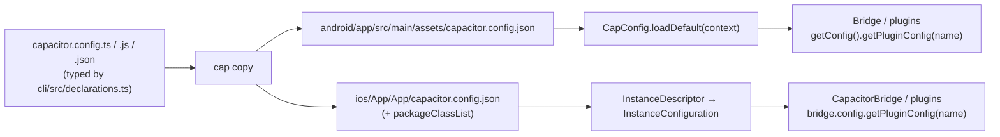
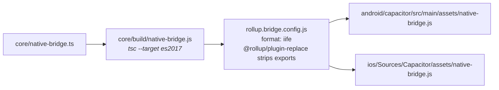
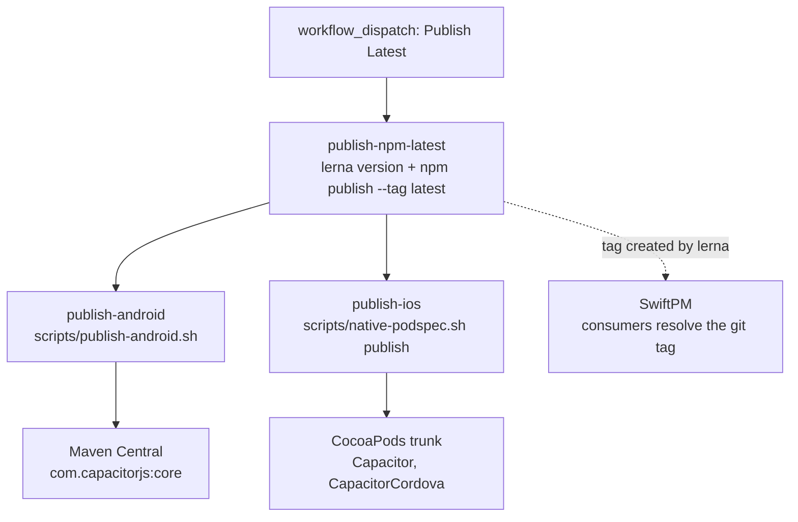

# Capacitor Architecture

This document describes how the Capacitor core repository is put together: what the
packages are, how the JavaScript runtime talks to the native runtimes, what each
platform does under the hood, and how the whole thing is built and released.

It describes the repository as it currently stands. It is a contributor-facing document —
for end-user documentation see [capacitorjs.com/docs](https://capacitorjs.com/docs).

---

## Table of contents

- [1. What Capacitor is, structurally](#1-what-capacitor-is-structurally)
- [2. Repository layout](#2-repository-layout)
- [3. Package boundaries](#3-package-boundaries)
- [4. Native bridge lifecycle](#4-native-bridge-lifecycle)
- [5. iOS internals](#5-ios-internals)
- [6. Android internals](#6-android-internals)
- [7. Web and custom platforms](#7-web-and-custom-platforms)
- [8. Configuration flow](#8-configuration-flow)
- [9. Build pipeline](#9-build-pipeline)
- [10. Release process](#10-release-process)
- [11. Testing and CI](#11-testing-and-ci)
- [12. Invariants and gotchas](#12-invariants-and-gotchas)

---

## 1. What Capacitor is, structurally

A Capacitor app is a web app running inside a platform web view (WKWebView on iOS,
Android's `WebView` on Android), with a message channel to a native host process. The
repository contains four shipped packages plus the project templates the CLI uses to
scaffold native projects:

| Package | Language | Ships as |
| --- | --- | --- |
| `@capacitor/core` | TypeScript | npm |
| `@capacitor/cli` | TypeScript (Node) | npm |
| `@capacitor/ios` | Swift + Objective-C | npm (sources), CocoaPods, SwiftPM |
| `@capacitor/android` | Java | npm (sources), Maven Central |

There are **two distinct JavaScript runtimes** in this repo, and conflating them is the
single most common source of confusion:

1. **`@capacitor/core`** (`core/src/`) — the module app code imports. Ships to npm,
   bundled by the app's own bundler. It knows about platforms abstractly and is
   *platform-agnostic*: on the web it is the whole runtime; on native it is a thin
   façade over globals the native layer installed.
2. **`native-bridge.js`** (`core/native-bridge.ts`) — a standalone IIFE injected into
   the web view **by the native layer before any page script runs**. It is never
   imported by app code and is not part of the `@capacitor/core` module graph. It is
   compiled into `android/capacitor/src/main/assets/native-bridge.js` and
   `ios/Sources/Capacitor/assets/native-bridge.js` as generated, committed artifacts.



---

## 2. Repository layout

```
capacitor/
├── core/                            @capacitor/core — JS runtime + native-bridge source
├── cli/                             @capacitor/cli — `cap` command
├── ios/                             @capacitor/ios — Swift/ObjC runtime
├── android/                         @capacitor/android — Java runtime (2 Gradle modules)
├── android-template/                scaffold for `cap add android`
├── ios-spm-template/                scaffold for `cap add ios` (default, SwiftPM)
├── ios-pods-template/               scaffold for `cap add ios --packagemanager cocoapods`
├── capacitor-cordova-android-plugins/   Cordova compat scaffold (Android)
├── capacitor-cordova-ios-plugins/       Cordova compat scaffold (iOS)
├── Package.swift                    SwiftPM manifest for the iOS runtime
├── scripts/                         repo tooling (asset packing, publishing, version sync)
└── .github/workflows/               CI + publish workflows
```

The npm workspaces are exactly `android`, `ios`, `cli`, `core` (see the root
`package.json`). The template directories are **not** workspaces — they are packed into
tarballs and shipped inside `@capacitor/cli`.

---

## 3. Package boundaries

### 3.1 Dependency graph



Key properties:

- **No package imports another at compile time.** `@capacitor/ios` and
  `@capacitor/android` declare `@capacitor/core` only as a `peerDependency`, and never
  import it — the coupling is the injected `native-bridge.js` and the shape of the
  messages on the wire. `scripts/sync-peer-dependencies.mjs` keeps those peer ranges
  pinned to core's major/minor on every `lerna version`.
- **The CLI does not depend on the platform packages either.** It resolves them from the
  *app's* `node_modules` at `sync`/`update` time (`resolveNode(config.app.rootDir, '@capacitor/android', …)`),
  so a given CLI version can drive a range of runtime versions.
- **The only hard cross-package artifact is `native-bridge.js`**, which flows
  `core → ios` and `core → android` as a committed generated file.

### 3.2 `@capacitor/core` — public vs internal

Public surface is exactly what `core/src/index.ts` re-exports:

- `Capacitor` (the global instance) and `registerPlugin`
- `WebPlugin` — the base class every web implementation extends
- `CapacitorException`, `ExceptionCode`
- The built-in plugin objects: `CapacitorHttp`, `CapacitorCookies`, `WebView`,
  `SystemBars`, plus `buildRequestInit`
- Types: `CapacitorGlobal`, `Plugin`, `PluginListenerHandle`, `PluginCallback`,
  `PluginImplementations`, `PermissionState`, `PluginResultData`, `PluginResultError`,
  and the built-in plugins' option/result types

Internal (not exported from the package entry point, no compatibility guarantee):

- `core/src/definitions-internal.ts` — `CapacitorInstance`, `CallData`,
  `MessageCallData`, `ErrorCallData`, `PluginResult`, `StoredCallback`, `PluginHeader`,
  `WindowCapacitor`. This file is the **wire-format contract** with the native layers.
- `core/src/runtime.ts` — `createCapacitor`/`initCapacitorGlobal`, the `Proxy` factory.
- `core/native-bridge.ts` — exports `initBridge` only so the Jest suite can drive it
  (`// Export only for tests`); the rollup build strips exports entirely.

`CapacitorInstance` extends the public `CapacitorGlobal` with the low-level members the
native layers call into: `toNative`, `fromNative`, `nativeCallback`, `nativePromise`,
`triggerEvent`, `createEvent`, `logJs`, `withPlugin`, `Plugins`, `PluginHeaders`. These
are documented as internal but are effectively frozen API, because compiled native code
in the wild calls them by name.

### 3.3 `@capacitor/ios` — public vs internal

`Package.swift` defines five targets across three products:

| Target | Language | Depends on | Notes |
| --- | --- | --- | --- |
| `CapacitorObjC` | ObjC | — | `CAPPlugin`, `CAPPluginCall`, `CAPPluginMethod`, `CAPBridgedPlugin`, `CAPInstanceDescriptor/Configuration`. Public headers under `include/Capacitor`. |
| `Capacitor` | Swift | `CapacitorObjC` | The bridge, view controller, web view handlers, JS types, built-in plugins. Carries `assets/native-bridge.js` as a resource. |
| `CapacitorObjCShims` | ObjC | `Capacitor` | Module map + shims that need the generated `Capacitor-Swift.h`. |
| `Cordova` | ObjC | — | `CDV*` compatibility layer. |
| `CapacitorCordova` | Swift | `Capacitor`, `Cordova` | Glue plugin. |

The ObjC-first split exists to break a cycle: Swift code needs the ObjC plugin base
classes, and some ObjC code needs Swift symbols. `CAPPlugin.h` deliberately stores the
bridge as an untyped `NSObject *bridgeRef` so the ObjC target never has to see the
Swift-defined `CAPBridgeProtocol`; the typed `bridge` accessor is vended from Swift in
`CAPPlugin+Bridge.swift`.

Public (plugin authors and app integrators depend on these):

- `CAPBridgeViewController` (`open`) — subclass hooks: `instanceDescriptor()`,
  `webViewConfiguration(for:)`, `webView(with:configuration:)`, `router()`,
  `capacitorDidLoad()`.
- `CapacitorBridge` (`open`) conforming to `CAPBridgeProtocol`.
- `CAPPlugin`, `CAPPluginCall`, `CAPBridgedPlugin`, the `CAP_PLUGIN`/`CAP_PLUGIN_METHOD`
  macros, `CAPPluginMethod`.
- `JSValueContainer`/`JSObject`/`JSValue`, `JSValueEncoder`/`JSValueDecoder`.
- `WebViewAssetHandler`, `WebViewDelegationHandler` (both `open` — subclassable),
  `Router`/`CapacitorRouter`, `WebViewListener`-equivalent notifications in
  `CAPNotifications.swift`.
- `SceneDelegateProxy` / `ApplicationDelegateProxy`.

Internal: `JSExport` (`internal class`), `JSCall`/`JSResult`/`JSResultError`
(`internal struct`s — `JSCall` itself is `public` but only produced by the bridge),
`JSResultSerialization`, `KeyValueStore`, `AppUUID`.

### 3.4 `@capacitor/android` — public vs internal

Two Gradle modules (`android/settings.gradle`):

- `:capacitor-android` → `android/capacitor`, namespace `com.getcapacitor.android`
- `:capacitor-cordova-android` → `android/capacitor-cordova`

Public: `Bridge` (+ `Bridge.Builder`), `BridgeActivity`, `Plugin`, `PluginCall`,
`JSObject`/`JSArray`/`JSValue`, `PluginResult`, the annotations
(`@CapacitorPlugin`, `@PluginMethod`, `@Permission`, `@PermissionCallback`,
`@ActivityCallback`), `CapConfig`/`PluginConfig`, `WebViewListener`, `Logger`,
`PermissionState`, `RouteProcessor`/`ProcessedRoute`, `ServerPath`.

Internal in practice (Java `public` for cross-package access inside the library, but not
a stable contract): `MessageHandler`, `JSExport`, `JSInjector` (package-private),
`WebViewLocalServer`, `AndroidProtocolHandler`, `UriMatcher`, `PluginHandle`,
`PluginMethodHandle`, `PluginManager`, `BridgeWebViewClient`, `BridgeWebChromeClient`.

### 3.5 `@capacitor/cli` — public vs internal

`cli/package.json` publishes `dist/**/*.js` plus **only** `dist/declarations.d.ts`. That
is deliberate: the CLI's public API is the *configuration schema*
(`cli/src/declarations.ts` — `CapacitorConfig`, `PluginsConfig`, platform-specific
option types), which apps import in `capacitor.config.ts`. Everything else is a private
implementation detail reachable only through the `cap` binary.

Requires Node `>=24`; `bin/capacitor` checks `process.version` against
`engines.node` before loading `dist/index.js`.

---

## 4. Native bridge lifecycle

### 4.1 Bootstrap order

Everything hinges on scripts landing in the right order *before* app code runs.



On iOS these are three `WKUserScript`s added at `.atDocumentStart` to the
`WKUserContentController` (`JSExport.exportCapacitorGlobalJS`, `exportBridgeJS`,
`exportJS(for:)`). On Android the same three strings are concatenated by `JSInjector`
and installed either via `WebViewCompat.addDocumentStartJavaScript` (preferred, when the
`DOCUMENT_START_SCRIPT` feature is available) or, as a fallback, spliced into the `<head>`
of the HTML response by `WebViewLocalServer`.

Because `native-bridge.js` has already defined `window.Capacitor.toNative` and friends by
the time the app bundle executes, `@capacitor/core`'s `createCapacitor(win)` finds an
existing `win.Capacitor` and **augments** it rather than replacing it
(`core/src/runtime.ts`: `const cap = win.Capacitor || {}`).

### 4.2 Message format

Web → native (`core/src/definitions-internal.ts`):

```ts
// type: 'message' (the normal plugin call)
interface MessageCallData {
  type?: 'message';
  callbackId: string;   // '-1' means "fire and forget, no stored callback"
  pluginId: string;     // the plugin's JS name, e.g. 'Camera'
  methodName: string;   // e.g. 'getPhoto'
  options: any;         // the single catch-all options object
}

// type: 'js.error' (uncaught window error, only when Capacitor.DEBUG)
interface ErrorCallData {
  type: 'js.error';
  error: { message: string; url: string; line: number; col: number; errorObject: string };
}
```

Native → web:

```ts
interface PluginResult {
  callbackId?: string;
  pluginId?: string;
  methodName?: string;
  success: boolean;
  data: PluginResultData;      // present when success
  error?: PluginResultError;   // present when !success; { message, code?, … }
  save?: boolean;              // true ⇒ keep the callback registered (listeners, callbacks)
}
```

Transport differs per platform but the payload does not:

| Direction | iOS | Android |
| --- | --- | --- |
| Web → native | `window.webkit.messageHandlers.bridge.postMessage(obj)` — a real object; `type` defaulted to `'message'` | `window.androidBridge.postMessage(JSON.stringify(obj))` — a string |
| Native → web | `webView.evaluateJavaScript("window.Capacitor.fromNative({…})")` | `JavaScriptReplyProxy.postMessage(json)` → `androidBridge.onmessage` → `returnResult(JSON.parse(e.data))`; legacy fallback is `evaluateJavascript("window.Capacitor.fromNative(…)")` |
| Sync web → native | `prompt(JSON.stringify({ type: … }))` intercepted in `runJavaScriptTextInputPanelWithPrompt` | dedicated `@JavascriptInterface` objects (`CapacitorCookiesAndroidInterface`, `CapacitorHttpAndroidInterface`) |

The synchronous `prompt()` channel on iOS exists because `document.cookie` and the
"is CapacitorHttp enabled?" check must answer synchronously, and `WKWebView` offers no
synchronous message handler.

#### What can cross the bridge

**Only JSON-representable data.** The channel is a JSON string on Android and a
JSON-compatible object on iOS; class instances, functions, `Blob`s, typed arrays and
anything else with custom serialisation must be converted first (the `CapacitorHttp`
patches in `native-bridge.ts` do exactly this, base64-encoding `File`s and draining
`ReadableStream`s before they reach the bridge).

iOS makes the contract explicit as the `JSValue` protocol in `JSTypes.swift`, which
exactly these types conform to:

```
String · Bool · Int · Float · Double · NSNumber · NSNull · Date
Array · Dictionary where Key == String, Value == JSValue
```

with `JSObject = [String: JSValue]` and `JSArray = [JSValue]`. Two consequences:

- **`Date` is a first-class native value but not a JSON one.** Dates are converted to
  ISO 8601 strings in both directions — inbound by
  `JSTypes.coerceDictionaryToJSObject(_:formattingDatesAsStrings:)`, outbound by
  `JSResultSerialization`, which walks nested dictionaries and arrays. A plugin can opt
  out of inbound stringification with `shouldStringifyDatesInCalls` on `CAPPlugin`.
- **`NSNull`, not `nil`.** Objective-C collections cannot hold `nil`, so JS `null`
  arrives as `NSNull`. Check the value's type rather than testing for key presence;
  `Array+Capacitor.swift` provides `replacingNullValues()` / `replacingOptionalValues()`
  to convert between `[JSValue]` and `[JSValue?]`.

### 4.3 Callback identity and async modes

`cap.toNative()` in `core/native-bridge.ts` owns callback registration:

- A module-level `Map` (`callbacks`) holds `StoredCallback` entries keyed by id.
- `callbackIdCount` starts at `Math.floor(Math.random() * 134217728)` rather than `0`,
  so that a late result from a *previous* page load cannot collide with an id from the
  current one.
- If no callback/resolver is supplied, the id is the sentinel `'-1'` and nothing is
  stored.

Three calling conventions are generated from the plugin's declared return type:

| Return type | JS entry point | Native declaration |
| --- | --- | --- |
| `promise` | `Capacitor.nativePromise(plugin, method, options)` | iOS: `CAP_PLUGIN_METHOD(x, CAPPluginReturnPromise)` / `CAPPluginMethod(_:returnType: .promise)`; Android: `@PluginMethod` (default) |
| `callback` | `Capacitor.nativeCallback(plugin, method, options, cb)` | `CAPPluginReturnCallback` / `@PluginMethod(returnType = RETURN_CALLBACK)` |
| `none` | `Capacitor.nativeCallback(plugin, method, options)` | `CAPPluginReturnNone` / `@PluginMethod(returnType = RETURN_NONE)` |

Which convention a given `Plugins.X.y()` call uses is decided **on the native side** and
shipped to JS as `window.Capacitor.PluginHeaders` — an array of
`{ name, methods: [{ name, rtype? }] }`. `registerPlugin()` in `core/src/runtime.ts`
consults that header to decide, per method, whether to route to `nativePromise`,
`nativeCallback`, or a JS implementation:

```
createPluginMethod(impl, prop):
  if pluginHeader has method `prop`:
      rtype === 'promise' → nativePromise
      otherwise           → nativeCallback
  else if a JS implementation for this platform exists → impl[prop]
  else → throw CapacitorException(UNIMPLEMENTED)
```

Every plugin object returned by `registerPlugin()` is a `Proxy`, so methods are
materialised lazily on property access and a plugin never needs a hand-written JS
surface. The proxy also special-cases `$$typeof` (returns `undefined`, so React does not
mistake the proxy for an element) and `toJSON`.

### 4.4 Keeping calls alive

A plugin call is released after its first result unless it opts in:

- iOS: `call.keepAlive` → `bridge.saveCall(call)` after `perform`; the outgoing result
  carries `save: true`.
- Android: `call.setKeepAlive(true)` → `bridge.saveCall(call)`; `MessageHandler` writes
  `data.put("save", call.isKeptAlive())`.

On the JS side, `returnResult()` deletes the stored callback when a *promise* resolves,
and additionally deletes it whenever `result.save === false`. This is how
`addListener` works: the listener registration is a `keepAlive` call whose callback is
invoked once per event.

### 4.5 Round trip: web → native → web



### 4.6 Events: native → web

Listener registration is itself a bridge call, so events ride the same channel as
results — there is no separate event bus for plugin events.



Separately, the native layers can push *document/window DOM events* (not plugin events)
by evaluating `window.Capacitor.triggerEvent(name, target, data)` —
`triggerWindowJSEvent` / `triggerDocumentJSEvent` on both platforms. This is how app
lifecycle transitions (`resume`, `pause`) reach the page, and it routes through
`cordova.fireDocumentEvent` when Cordova compatibility is present.

### 4.7 Error propagation

- **Native rejection → JS rejection.** `call.reject(message, code, error, data)`
  serialises to `{ success: false, error: { message, errorMessage, code, …data } }`.
  In `returnResult()`, the plain error object is copied key-by-key onto a fresh
  `new cap.Exception('')` so the rejection carries a real stack and `instanceof Error`
  holds. `CapacitorException` exposes `code` (`ExceptionCode.Unimplemented` /
  `Unavailable`) and a free-form `data` bag.
- **Unimplemented methods.** Web implementations call `this.unimplemented()` /
  `this.unavailable()` from `WebPlugin`. When no implementation exists at all for the
  active platform, the proxy throws
  `"<Plugin>.<method>() is not implemented on <platform>"` with code `UNIMPLEMENTED`
  before anything reaches the bridge.
- **Result with no stored callback.** If a result arrives for an unknown `callbackId`
  and it is an error, `native-bridge.js` logs it with `console.warn` rather than
  dropping it silently.
- **Serialisation failures.** iOS `JSResult.jsonPayload()` catches
  `JSONSerialization` failures and emits `{}` plus a targeted log naming the plugin and
  method.
- **Native-side routing failures are logged, not surfaced.** If the plugin id is unknown
  or the selector does not exist, iOS `handleJSCall` logs and `return`s — the JS promise
  never settles. Android's `callPluginMethod` is stricter: an unknown plugin calls
  `call.errorCallback(...)`, so the promise rejects.
- **JS errors → native log.** When `Capacitor.DEBUG` is set (iOS/Android debug builds),
  `window.onerror` is wired to `cap.handleWindowError`, which posts a
  `{ type: 'js.error' }` message. iOS renders it as the "STARTUP JS ERROR" block;
  Android logs it through the `js.error` interceptor.
- **Console bridging (iOS only).** `debug/error/info/log/trace/warn` on `window.console`
  are wrapped to also `toNative('Console', 'log', …)`, so web logs appear in Xcode.
  Android gets this for free from `BridgeWebChromeClient`.

### 4.8 Threading

| | iOS | Android |
| --- | --- | --- |
| Inbound message received on | main thread (`WKScriptMessageHandler`) | the WebView/UI thread (`@JavascriptInterface` or `WebMessageListener`) |
| Plugin method executes on | `bridge.dispatchQueue` — a **serial** `DispatchQueue(label: "bridge")` | `taskHandler`, a `Handler` on a **single** `HandlerThread("CapacitorPlugins")` |
| Hop to main/UI | `DispatchQueue.main.async` (the bridge does this for you in `toJs`, `eval`, `triggerJSEvent`, `logToJs`) | `bridge.executeOnMainThread(Runnable)`; `eval()` posts to `context.getMainLooper()` |
| Hop back to background | `bridge.getDispatchQueue()` | `bridge.execute(Runnable)` |
| Result delivery | `evaluateJavaScript` on main | `replyProxy.postMessage` from the calling thread, or `webView.post(…)` for the legacy `evaluateJavascript` path |
| Stored-call storage | `ConcurrentDictionary<CAPPluginCall>` (lock-guarded) | plain `HashMap` mutated from the plugin thread |

**Both platforms run every plugin method on one shared serial queue.** A plugin method
that blocks stalls every other plugin. Long work must be dispatched onward, and the
`PluginCall` resolved from the completion.

#### Why GCD and not Swift concurrency

The iOS column above is entirely Grand Central Dispatch because **the runtime is still
Swift 5 and has not adopted strict concurrency.** `Package.swift` declares
`swift-tools-version: 6.0` but pins the language mode back with `swiftLanguageModes: [.v5]`
at package level and `.swiftLanguageMode(.v5)` on every Swift target;
`Capacitor.podspec` declares `swift_version = '5.1'`. Tools version 6 does not imply
Swift 6 semantics here.

Across `ios/Sources/` there are zero `async func` declarations, zero `await`
expressions, zero `actor` declarations, and zero `Sendable`, `nonisolated` or
`@preconcurrency` annotations. The single `@MainActor` is in a WebKit-imposed
`WKNavigationDelegate` signature, not an adoption of actor isolation. All 18 occurrences
of `async` are `DispatchQueue.main.async` (17) and `dispatchQueue.async` (1) — grepping
for `async` in this codebase finds GCD, not Swift concurrency.

Two consequences run through the design:

- **Shared mutable state is guarded by hand, not by actor isolation.** The bridge's
  `storedCalls` uses `ConcurrentDictionary` (`KeyValueStore.swift`), an `NSLock` behind a
  `withLock` accessor.
- **Asynchrony is expressed as escaping completion closures**, which is also what the
  `@objc`-exported plugin surface can represent — `CAPPluginCall` carries
  `successHandler`/`errorHandler` rather than returning a value, and that shape is what
  lets the same call be resolved once, repeatedly (`keepAlive`), or from any thread.

Moving to Swift 6 language mode or enabling strict concurrency would be a deliberate,
wide-reaching migration rather than an incremental cleanup. `AGENTS.md` carries the
working rules for contributors.

Bridge state is reset on every navigation — iOS
`didStartProvisionalNavigation` → `bridge.reset()`, Android
`onPageStarted` → `bridge.reset()` — which clears saved calls and removes all plugin
listeners so a new page cannot receive the previous page's callbacks.

---

## 5. iOS internals

### 5.1 Hosting: SwiftUI front door, UIKit engine

As of Capacitor 9 the generated app is a SwiftUI `App` struct. The templates ship:

```swift
// App.swift
@main
struct CapacitorApp: App {
  @UIApplicationDelegateAdaptor(AppDelegate.self) var appDelegate

  var body: some Scene {
    WindowGroup {
      CapacitorView()
        .ignoresSafeArea()
        .onOpenURL { url in SceneDelegateProxy.shared.handle(openURL: url) }
        .onContinueUserActivity(NSUserActivityTypeBrowsingWeb) { activity in
          SceneDelegateProxy.shared.handle(userActivity: activity)
        }
    }
  }
}

// CapacitorView.swift
public struct CapacitorView: UIViewControllerRepresentable {
  public func makeUIViewController(context: Context) -> CAPBridgeViewController { CAPBridgeViewController() }
  public func updateUIViewController(_ vc: CAPBridgeViewController, context: Context) {}
}
```

The engine is still `CAPBridgeViewController`, a `UIViewController`. SwiftUI's
`.onOpenURL` / `.onContinueUserActivity` do not surface a `UIScene`, so
`SceneDelegateProxy.handle(openURL:scene:)` resolves the active foreground
`UIWindowScene` from `UIApplication.shared.connectedScenes` when none is passed, then
posts both the scene-aware notifications (`.capacitorSceneOpenURL`,
`.capacitorSceneOpenUniversalLink`) and the Capacitor 8 back-compat ones
(`.capacitorOpenURL`, `.capacitorOpenUniversalLink`). Plugins listening on either name
keep working. On cold start, plugins are not yet registered when
`scene(_:willConnectTo:)` fires, so queued URLs/activities are replayed on the first
`.capacitorViewDidAppear`.

### 5.2 View controller lifecycle

`CAPBridgeViewController.loadView()` (note: `final`) does the work, in order:

1. `instanceDescriptor()` → `InstanceConfiguration(with:isDebug:)`; set `CAPLog.enableLogging`; log config warnings.
2. Status bar and orientation defaults from `Info.plist`.
3. Build `WebViewAssetHandler(router: router())`, point it at the app location and server URL.
4. Build `WebViewDelegationHandler()` (which creates the `WKUserContentController` and registers itself as the `"bridge"` script message handler).
5. `prepareWebView(...)` — see below.
6. `view = webView`.
7. Construct `CapacitorBridge(with:delegate:assetHandler:delegationHandler:)`.
8. `capacitorDidLoad()` subclass hook, then `updateAppLocationIfNeeded()` (live-updates snapshot path).

`viewDidLoad()` then calls `loadWebView()`, which `exit(1)`s with a diagnostic if
`config.appStartFileURL` does not exist (a missing `npx cap copy`), otherwise loads
`config.appStartServerURL`.

### 5.3 Web view configuration

`webViewConfiguration(for:)` is `open` and intended to be overridden by calling `super`
and mutating the result. Defaults set in the base implementation:

- `websiteDataStore.httpCookieStore.add(CapacitorWKCookieObserver())`
- `allowsInlineMediaPlayback = true`, `mediaTypesRequiringUserActionForPlayback = []`,
  `allowsAirPlayForMediaPlayback = true`, `suppressesIncrementalRendering = false`
- `preferences.isElementFullscreenEnabled = true`
- `limitsNavigationsToAppBoundDomains` from config
- `applicationNameForUserAgent` appended from `appendedUserAgentString`
- `defaultWebpagePreferences.preferredContentMode` from `preferredContentMode`
  (`mobile` / `desktop` / recommended)

`prepareWebView(...)` then wires the pieces that must not be overridden loosely:

- `setURLSchemeHandler(assetHandler, forURLScheme: localURL.scheme ?? "capacitor")`
- `userContentController = delegationHandler.contentController`
- `uiDelegate` and `navigationDelegate` = the delegation handler; `scrollView.delegate`
  too when zooming is disabled (that is how pinch-zoom is suppressed)
- scroll bounce off, `contentInsetAdjustmentBehavior`, `allowsLinkPreview`,
  `isScrollEnabled`, custom user agent, background colour (falls back to
  `UIColor.systemBackground`), `setKeyboardShouldRequireUserInteraction(false)`
- `HTTPCookieStorage.shared.cookieAcceptPolicy = .always`

Web inspector: `webView.isInspectable = config.isWebDebuggable` on iOS 16.4+; older
systems get a warning that the flag has no effect.

### 5.4 Plugin registration and the ObjC bridge

Plugins are ObjC classes (or `@objc`-exposed Swift classes) conforming to
`CAPBridgedPlugin`, which requires `identifier`, `jsName`, and `pluginMethods`. The
`CAP_PLUGIN` macro generates that conformance as a category:

```objc
CAP_PLUGIN(CAPCameraPlugin, "Camera",
  CAP_PLUGIN_METHOD(getPhoto, CAPPluginReturnPromise);
)
```

Swift plugins can build `pluginMethods` directly with
`CAPPluginMethod(#selector(MyPlugin.getPhoto), returnType: .promise)`.

At startup `registerPlugins()`:

1. Always registers the built-ins: `CAPHttpPlugin`, `CAPConsolePlugin`,
   `CAPWebViewPlugin`, `CAPCookiesPlugin`, `CAPSystemBarsPlugin`.
2. If `autoRegisterPlugins` (the default), reads `packageClassList` from the bundled
   `capacitor.config.json` and resolves each entry through `NSClassFromString`. The CLI
   populates that list during `cap copy`/`update` by scanning plugin sources for
   `@objc(Name)` and `CAP_PLUGIN(Name`.
3. Instantiates each, calls `plugin.load(on:)`, stores it in `plugins[jsName]`, and
   emits its JS shim via `JSExport.exportJS(for:in:)`.

Apps that want explicit control set `autoRegisterPlugins = false` and call
`registerPluginType(_:)` / `registerPluginInstance(_:)`.
`CAPInstancePlugin` subclasses are skipped by auto-registration and must be registered
as instances.

### 5.5 Dispatching a call

`WebViewDelegationHandler.userContentController(_:didReceive:)` inspects `body["type"]`:

- `"js.error"` → `logJSError`
- `"message"` → build a `JSCall` and hand it to `bridge.handleJSCall`
- anything else → look up `bridge.callInterceptors[type]` (registered via
  `registerCallInterceptor(_:handler:)`) — this is the extension point plugins use for
  custom synchronous-ish channels.

`handleJSCall` resolves the plugin (falling back to `NSClassFromString(call.pluginId)` +
`loadPlugin` for lazily-loaded plugins), computes the selector — `addListener`,
`removeListener` and `removeAllListeners` get `NSSelectorFromString(method + ":")`,
everything else comes from `plugin.getMethod(named:)` — checks `responds(to:)`, and only
then hops to the serial `dispatchQueue`. Options are coerced with
`JSTypes.coerceDictionaryToJSObject(_:formattingDatesAsStrings:)` before the
`CAPPluginCall` is constructed, so plugins receive normalised `JSObject` values.

Results go back through `toJs` / `toJsError`, both of which build a JS literal and
`evaluateJavaScript` it on the main queue.

### 5.6 Assets, schemes and navigation

`WebViewAssetHandler` is a `WKURLSchemeHandler` registered for the configured scheme
(default `capacitor://localhost`). It:

- Short-circuits paths starting with `/_capacitor_http_interceptor_` into
  `handleCapacitorHttpRequest`, which performs the request natively (this is the
  fast path for `GET`/`HEAD`/`OPTIONS`/`TRACE` when `CapacitorHttp` is enabled).
- Otherwise maps the URL through the `Router` — `CapacitorRouter` rewrites any
  extension-less path to `/index.html`, which is what makes SPA client-side routing work.
- Resolves MIME types and streams the file from `config.appLocation`.

`decidePolicyFor navigationAction` enforces, in order:

1. Cancel anything under `/_capacitor_http_interceptor_` (the proxy returns a *remote*
   body at the app origin, so it must never become a document navigation).
2. Give every plugin a chance via `shouldOverrideLoad:` (`nil` = defer, `true` = cancel,
   `false` = allow).
3. Allow if the host matches `server.allowNavigation`.
4. For top-level navigations outside `serverURL`/`localURL`, cancel and hand the URL to
   `UIApplication.shared.open` — external links open in Safari, not in the app's web view.

Also handled here: media-capture and device-motion permission prompts (auto-granted at
the WebKit layer; the OS prompt still applies), `didFail`/`didFailProvisionalNavigation`
→ load `config.errorPathURL`, and `webViewWebContentProcessDidTerminate` → `reset()` +
`reload()`.

### 5.7 Distribution shapes

- **SwiftPM (default)**: root `Package.swift` vends `Capacitor`, `Cordova` and
  `CapacitorCordova`. The generated app carries a local `CapApp-SPM` package that
  depends on `https://github.com/ionic-team/capacitor` and on each plugin's own
  `Package.swift`.
- **CocoaPods**: `ios/Capacitor.podspec` and `ios/CapacitorCordova.podspec` point at
  `Sources/` (with an `ios/` prefix when `NATIVE_PUBLISH=true`, because trunk publishes
  from the repo root while apps consume the npm package). The `Capacitor` podspec
  excludes the SPM-only `Capacitor-Swift.h` shim, since CocoaPods generates the real one.

---

## 6. Android internals

### 6.1 Activity and bridge construction

`BridgeActivity.onCreate` sets the theme, inflates
`R.layout.capacitor_bridge_layout_main` (falling back to `R.layout.no_webview` if the
system WebView is missing), loads plugin classes from `assets/capacitor.plugins.json`
via `PluginManager`, and calls `Bridge.Builder.create()`.

The `Bridge` constructor, in order:

1. Start `HandlerThread("CapacitorPlugins")`; create `taskHandler` on its looper.
2. Load `CapConfig` (default: `assets/capacitor.config.json`); init `Logger`.
3. `initWebView()` — `WebSettings`: JavaScript enabled, DOM storage, geolocation,
   `setMediaPlaybackRequiresUserGesture(false)`,
   `setJavaScriptCanOpenWindowsAutomatically(true)`, optional mixed content, user-agent
   append/override, background colour, zoom controls, `setWebContentsDebuggingEnabled`.
   Also computes `localUrl`/`appUrl` from scheme + hostname (default
   `https://localhost`, from `CapConfig.androidScheme`) or from `server.url`, and
   appends `server.startPath` if configured.
4. `setAllowedOriginRules()` — the origin allowlist used by the `WebMessageListener`.
5. Construct `MessageHandler`.
6. `registerAllPlugins()` — built-ins `CapacitorCookies`, `WebView`, `CapacitorHttp`,
   `SystemBars`, then app plugin classes and instances.
7. `loadWebView()` — install the document-start script, start `WebViewLocalServer`,
   set `BridgeWebChromeClient`/`BridgeWebViewClient`, optionally install a
   `ServiceWorkerClient`, apply any persisted live-update server path, verify the system
   WebView meets `minWebViewVersion` (default 60; Huawei 10), then `loadUrl(appUrl)`.

`Bridge` is constructed only through `Bridge.Builder`, which also registers the two
built-in message interceptors:

```java
bridge.registerInterceptor("message", postData -> { … new PluginCall(…); bridge.callPluginMethod(…); });
bridge.registerInterceptor("js.error", postData -> Logger.error("JavaScript Error: " + postData));
```

Additional interceptors can be registered by plugins for custom message types —
the Android analogue of iOS's `registerCallInterceptor`.

### 6.2 The message channel

`MessageHandler`'s constructor picks a transport:

```java
if (WebViewFeature.isFeatureSupported(WEB_MESSAGE_LISTENER) && !config.isUsingLegacyBridge()) {
    WebViewCompat.addWebMessageListener(webView, "androidBridge", bridge.getAllowedOriginRules(), capListener);
} else {
    webView.addJavascriptInterface(this, "androidBridge");   // legacy
}
```

The modern path is origin-scoped and gives a `JavaScriptReplyProxy` for responses; it
also rejects messages from sub-frames (`Plugin execution is allowed in Main Frame only`).
The legacy `@JavascriptInterface` path is used when the feature is unavailable, when
`addWebMessageListener` throws, or when the app opts into
`android.useLegacyBridge`. Either way the JS side only ever sees
`window.androidBridge.postMessage(...)`.

Responses take the inverse path in `sendResponseMessage`: `replyProxy.postMessage(json)`
when available (received by `androidBridge.onmessage` in `native-bridge.js`), otherwise
`webView.post(() -> webView.evaluateJavascript("window.Capacitor.fromNative(" + json + ")", null))`.
A call whose `callbackId` is the dangling sentinel `"-1"` is routed to
`bridge.getApp().fireRestoredResult(data)` — that is the process-death restoration path,
where a result arrives for a call whose JS callback no longer exists.

### 6.3 Plugin model

```java
@CapacitorPlugin(
    name = "Camera",
    permissions = { @Permission(strings = { Manifest.permission.CAMERA }, alias = "camera") }
)
public class CameraPlugin extends Plugin {
    @PluginMethod                                       // returnType defaults to "promise"
    public void getPhoto(PluginCall call) { … call.resolve(result); }
}
```

- `PluginHandle` indexes every `public` method annotated with `@PluginMethod` by name at
  registration time (`Class.getMethods()` + annotation scan), then invokes by reflection.
- `@PermissionCallback` and `@ActivityCallback` mark the methods the AndroidX
  `ActivityResult`/permission flows call back into; `Bridge.registerForActivityResult`
  wires the launchers in `initializeActivityLaunchers()`.
- `@CapacitorPlugin(requestCodes = …)` is the deprecated legacy path, kept so plugins
  wrapping third-party SDKs that still use `onActivityResult` request codes keep working.
  `BridgeActivity` tries the legacy route first and falls through to the AndroidX flow.
- Events use `notifyListeners(eventName, data, retainUntilConsumed)`; retained events are
  flushed when the first listener for that event registers.

### 6.4 Asset serving and the local server

`BridgeWebViewClient.shouldInterceptRequest` delegates everything to
`WebViewLocalServer.shouldInterceptRequest`, which handles:

- `/_capacitor_http_interceptor_?u=<url>` → native HTTP fetch (the `CapacitorHttp` proxy)
- `/_capacitor_file_` → a file on disk, `/_capacitor_content_` → a `content://` URI
- ordinary asset paths, served by `AndroidProtocolHandler` from
  `app/src/main/assets/public`, with `html5mode` falling back to `index.html`
- injecting the Capacitor bootstrap `<script>` into HTML documents, when
  `addDocumentStartJavaScript` was unavailable

`shouldOverrideUrlLoading` → `Bridge.launchIntent(url)`, which mirrors the iOS policy:
block the interceptor path, ask plugins (`shouldOverrideLoad`), allow `data:`/`blob:`,
allow same-origin or `allowNavigation`-matched hosts (via `HostMask`), otherwise fire an
`ACTION_VIEW` intent and cancel.

`BridgeWebChromeClient` covers file chooser, permission requests, geolocation prompts,
JS dialogs and console forwarding. `WebViewListener` lets apps hook
`onPageLoaded`, `onPageStarted`, `onReceivedError`, `onRenderProcessGone`,
`onPageCommitVisible`.

### 6.5 Manifest and Gradle

The library's own `android/capacitor/src/main/AndroidManifest.xml` is **empty** — the
runtime declares no permissions or components of its own; everything comes from the app
or from plugins via manifest merging.

The app template (`android-template/app/src/main/AndroidManifest.xml`) declares:

- `MainActivity` (`launchMode="singleTask"`, `exported="true"`, a broad `configChanges`
  list so rotation and locale changes do not recreate the web view)
- an `androidx.core.content.FileProvider` with authority `${applicationId}.fileprovider`
  and `@xml/file_paths` — the shared provider plugins use to hand out `content://` URIs
- `android.permission.INTERNET`

Cordova plugins' manifest fragments are merged into
`capacitor-cordova-android-plugins` by the CLI (`writeCordovaAndroidManifest`).

Module build settings (`android/capacitor/build.gradle`): AGP 9.2.1, `compileSdk` 37,
`minSdk` 26, Java 21 source/target, `lintOptions` with
`abortOnError = true` and `warningsAsErrors = true` against a checked-in
`lint-baseline.xml`. Dependencies are limited to AndroidX (`appcompat`, `core`,
`activity`, `fragment`, `coordinatorlayout`, `webkit`) — consistent with the project's
policy of minimising third-party dependencies.

`android-template/app/build.gradle` applies the generated `capacitor.build.gradle` and
conditionally applies the Google Services plugin if `google-services.json` exists.

---

## 7. Web and custom platforms

On the web there is no `native-bridge.js` and no `PluginHeaders`. `getPlatformId()`
returns `'web'` (nothing defined `androidBridge` or `webkit.messageHandlers.bridge`), so
`registerPlugin` resolves methods purely from the `PluginImplementations` map:

```ts
export const Camera = registerPlugin<CameraPlugin>('Camera', {
  web: () => import('./web').then((m) => new m.CameraWeb()),
});
```

Implementations may be a value or a lazy factory; factories are awaited once and cached
in `loadPluginImplementation()`, which keeps web-only code out of the initial bundle.

`WebPlugin` (`core/src/web-plugin.ts`) provides the event machinery that mirrors the
native side: `addListener`/`removeAllListeners`, `notifyListeners` with
`retainUntilConsumed`, `registerWindowListener` for bridging DOM events into plugin
events, and `unimplemented()`/`unavailable()` helpers.

A third-party host can present itself as a non-web, non-native platform by defining
`window.CapacitorCustomPlatform = { name, plugins }` before `@capacitor/core` loads.
`getPlatform()` then returns that name, and `loadPluginImplementation` falls back to the
`web` implementation when the custom platform has no entry of its own — this is how
Electron-style platforms are supported without changes to core.

---

## 8. Configuration flow



- The source of truth is the app's `capacitor.config.*`, typed by the CLI's
  `declarations.d.ts`. `loadExtConfig` prefers `.ts`, then `.js`, then `.json`.
- `cap copy` serialises the evaluated config to `capacitor.config.json` inside each
  native project (stripping `android.buildOptions` / `ios.buildOptions`, which are
  build-time only and must not ship in the app bundle).
- On iOS the same file also carries `packageClassList`, written by
  `generateIOSPackageJSON`; `CapacitorBridge.registerPlugins()` reads it back.
- On Android the plugin list lives in a separate `assets/capacitor.plugins.json`
  (`{ pkg, classpath }` entries) read by `PluginManager`.
- Per-plugin configuration reaches plugins as `PluginConfig` on both platforms, keyed by
  the plugin's JS name.
- A handful of settings are read directly from the platform instead of the JSON —
  `UIStatusBarHidden`/`UIStatusBarStyle`/`UISupportedInterfaceOrientations` from
  `Info.plist` on iOS, `FLAG_DEBUGGABLE` for dev-mode detection on Android.

---

## 9. Build pipeline

### 9.1 Monorepo mechanics

npm workspaces (`android`, `ios`, `cli`, `core`) + Lerna (versioning/publishing) + Nx
(task graph and build caching; `build` is cacheable and depends on `^build`).

Root scripts:

| Script | What it does |
| --- | --- |
| `npm run lint` | `eslint . --ext ts` + `prettier --check` (with `prettier-plugin-java`, so Java is formatted too) + `swiftlint lint` |
| `npm run fmt` | the same three with `--fix` / `--write` |
| `npm run build:nativebridge` | `lerna run build:nativebridge` → regenerates the injected bridge for both platforms |
| `npm run sync-peer-dependencies` | rewrites `@capacitor/core` peer ranges in the platform packages; runs automatically on the npm `version` lifecycle |

### 9.2 `@capacitor/core`

```
npm run build  =  clean → docgen → transpile → rollup
```

- **docgen** (`@capacitor/docgen`) regenerates `cookies.md`, `http.md` and
  `system-bars.md` from the built-in plugin interfaces. These are shipped in the package.
- **transpile** — `tsc` with `core/tsconfig.json`: `files: ["src/index.ts"]`, target
  `es2017`, module `es2015`, emit to `build/`, declarations to `types/`.
  `importHelpers` + `noEmitHelpers` means helpers come from the `tslib` runtime dependency.
- **rollup** (`rollup.config.js`) takes `build/index.js` and emits three bundles:

| Output | Format | Consumer |
| --- | --- | --- |
| `dist/index.js` | ESM | bundlers (`module`) |
| `dist/index.cjs.js` | CJS | Node / `require` (`main`), dynamic imports inlined |
| `dist/capacitor.js` | IIFE, minified | `<script>` tag / unpkg |

Tree-shaking is load-bearing: `global.ts` marks `initCapacitorGlobal(...)` with
`/*#__PURE__*/`, and `core/src/tests/build-treeshaking.js` (`npm run test.treeshaking`)
rolls up a module that side-effect-imports the built package entry and fails unless the
resulting bundle is completely empty. Any accidental top-level side effect in `core/src`
breaks that test.

### 9.3 `native-bridge.js` — the cross-package generated artifact



Run `npm run build:nativebridge` after **any** change to `core/native-bridge.ts` and
commit the two generated files — they are checked in, banner-marked
`/* Generated File. Do not edit. */`, and listed in `.eslintignore`/`.prettierignore`.
The replace plugin rewrites `module.exports`, `exports.__esModule` and
`exports.initBridge` to the unused `dummy` variable, which is why `native-bridge.ts`
declares `let dummy = {}` at the top.

Android ships the file as an asset; iOS ships it as an SPM `.copy("assets")` resource and
as `s.resources` in the podspec, and `JSExport.exportBridgeJS` resolves it from
`Bundle.module` (SwiftPM) or `Bundle(for:)` (CocoaPods).

### 9.4 `@capacitor/cli`

```
npm run build  =  clean → assets → tsc
```

`assets` runs `scripts/pack-cli-assets.mjs`, which tars each template directory
(`android-template`, `ios-pods-template`, `ios-spm-template`,
`capacitor-cordova-android-plugins`, `capacitor-cordova-ios-plugins`) into
`cli/assets/*.tar.gz`. It uses `git ls-files` as the file list, so anything untracked in
a template is silently excluded — a new template file must be `git add`ed before it will
ship. `cli/assets/` is generated and not committed.

Commands are registered eagerly with `commander` but their implementations are loaded
with `await import()` inside the action, keeping `cap --help` fast.

### 9.5 How native code gets linked into an app

This is what `cap sync` (= `copy` + `update`) actually produces:

**Android**

| Generated file | Written by | Contents |
| --- | --- | --- |
| `android/app/src/main/assets/public/**` | `copy` | the built web app |
| `android/app/src/main/assets/capacitor.config.json` | `copy` | evaluated config |
| `android/app/src/main/assets/capacitor.plugins.json` | `update` | `{ pkg, classpath }` for every discovered plugin |
| `android/capacitor.settings.gradle` | `update` | `include ':capacitor-android'` + one `include` per plugin, each pointed at its `node_modules` path |
| `android/app/capacitor.build.gradle` | `update` | `implementation project(':…')` per plugin, Cordova framework dependencies, Java 21 compile options |

Both Gradle files start with `// DO NOT EDIT THIS FILE! IT IS GENERATED EACH TIME "capacitor update" IS RUN`.
Plugin classes are discovered by scanning each plugin's `android/src/main` for
`/^@CapacitorPlugin[\s\S]+?class (\w+)/` plus the preceding `package` declaration.

**iOS, SwiftPM (default)**

`update` regenerates `ios/App/CapApp-SPM/Package.swift` with a `.package` entry per
plugin that ships its own `Package.swift`. Plugins without one are reported as
"not compatible with SPM". The CLI also checks each plugin's declared Capacitor
dependency major against the installed `@capacitor/ios` and either warns or rewrites it
so SPM resolves a single Capacitor package identity.

**iOS, CocoaPods**

`update` rewrites the `def capacitor_pods … end` block in `ios/App/Podfile` with
`pod 'Capacitor', :path => …` plus one `pod` line per plugin (path-relative into
`node_modules`), then runs `pod install` (or `bundle exec pod install`) and
`xcodebuild clean`.

**Both**

`copy` writes `packageClassList` into the iOS `capacitor.config.json` by scanning plugin
sources for `@objc(Name)` (Swift) and `CAP_PLUGIN(Name` (ObjC).

---

## 10. Release process

Versioning and npm publishing are Lerna-driven from the repo root. `lerna.json` sets
`conventionalCommits: true`, `tagVersionPrefix: ""` (tags are bare versions like
`9.0.0`, not `v9.0.0`), `createRelease: "github"`, and message `Release %s`. It also
pins `command.version.allowBranch` to the release branch, so a version can only be cut
from there. All four packages are force-published together, so their versions stay in
lockstep.

Root scripts map to release channels:

| Script | Effect |
| --- | --- |
| `ci:publish:nightly` | prerelease `nightly-<timestamp>`, no changelog/tag/push, npm tag `nightly` |
| `ci:publish:dev` | prerelease `dev-<timestamp>`, npm tag `dev` |
| `ci:publish:alpha` / `beta` / `rc` | prerelease with that preid, npm tag `next` |
| `ci:publish:latest` | normal version bump, npm tag `latest` |
| `ci:publish:latest-from-pre` | `--conventional-graduate` a prerelease to stable, npm tag `latest` |

All publish with `--provenance`. `npm version` triggers
`scripts/sync-peer-dependencies.mjs` so the platform packages' `@capacitor/core` peer
range tracks the new version.

Native artefacts are published *after* npm, from `main`:



- **Android** (`scripts/publish-android.sh`): reads the version from
  `android/package.json`, compares it against the `<latest>` in Maven Central's
  `maven-metadata.xml`, and skips if already published. Otherwise runs
  `:capacitor-android:publishReleasePublicationToSonatypeRepository closeAndReleaseSonatypeStagingRepository`
  with `CAP_PUBLISH=true` (which is what activates the `publish-root.gradle` /
  `publish-module.gradle` scripts and the signing plugin).
- **iOS** (`scripts/native-podspec.sh publish`): `pod trunk push` for
  `CapacitorCordova` then `Capacitor`, with `NATIVE_PUBLISH=true` so the podspecs
  prefix their source globs with `ios/`.
- **SwiftPM** needs no publish step — consumers resolve the git tag Lerna created against
  the root `Package.swift`.

---

## 11. Testing and CI

| Suite | Location | Runner |
| --- | --- | --- |
| Core JS | `core/src/tests/*.spec.ts` | Jest (`ts-jest` preset, `jest-jasmine2` runner, jsdom) |
| Core tree-shaking | `core/src/tests/build-treeshaking.js` | plain node, `npm run test.treeshaking` |
| CLI | `cli/test/*.spec.ts` | Jest, serial (`jest -i`) |
| iOS unit | `ios/Tests/CapacitorTests`, `ios/Tests/CapacitorObjCTests` | `xcodebuild test -scheme Capacitor-Package` |
| Android unit | `android/capacitor/src/test` | `gradlew :capacitor-android:test` |
| Android instrumented | `android/capacitor/src/androidTest` | connected-device Gradle tasks |

`.github/workflows/ci.yml` runs on PRs to any branch and on pushes to `main`:
`lint` (macOS, so SwiftLint runs) gates `test-cli`, `test-core`, `test-ios`
(macOS 26 + Xcode 26.6) and `test-android` (JDK 21). `npm run verify` is the per-platform
entry point — `xcodebuild build` + `xcodebuild test` for iOS, and
`clean lint build test` for Android.

Notable coverage worth keeping green when touching the bridge: `core/src/tests/bridge.spec.ts`
(drives `initBridge` directly), `plugin.spec.ts` / `runtime.spec.ts` (proxy and header
resolution), `ios/Tests/CapacitorTests/JSExportTests.swift` (the generated shim text),
`HttpInterceptorNavigationTests.swift` and `HttpInterceptorNavigationTest.java` (the
navigation block on the proxy path).

---

## 12. Invariants and gotchas

Things that will bite you when changing this codebase:

1. **`native-bridge.js` is generated and committed.** Editing `core/native-bridge.ts`
   without running `npm run build:nativebridge` changes nothing at runtime, and the two
   platform copies will silently drift.
2. **The wire format is a cross-repo contract.** `callbackId` / `pluginId` /
   `methodName` / `options` / `success` / `data` / `error` / `save` are read by
   third-party plugins and by older runtimes. Add fields; do not rename or repurpose them.
3. **`Capacitor.toNative` / `fromNative` / `nativePromise` / `nativeCallback` /
   `triggerEvent` / `logJs` / `withPlugin` are called by name from compiled native
   code.** They are marked internal but cannot be renamed without a coordinated release.
4. **Injection order is load-bearing.** The global stub must precede `native-bridge.js`,
   which must precede the plugin shims, all at document-start. Anything that defers a
   script breaks apps that call plugins during module evaluation.
5. **One serial queue per platform for all plugin work.** Blocking it blocks every
   plugin. Dispatch onward and resolve the `PluginCall` from the completion handler.
6. **Only `keepAlive` calls survive their first result**, and *every* saved call is
   dropped on navigation (`bridge.reset()`). A plugin that stores a call across a page
   reload must re-establish it.
7. **iOS silently drops calls it cannot route.** An unknown selector logs and returns
   without settling the JS promise; Android rejects instead. When adding routing paths,
   prefer rejecting.
8. **`@objc` is mandatory on iOS plugin methods.** Dispatch is `performSelector`-based;
   a method missing `@objc` compiles fine and fails at runtime with the
   "does not respond to method call" log.
9. **Plugin discovery is regex-based, not AST-based.** The CLI matches
   `@CapacitorPlugin … class X`, `@objc(X)` and `CAP_PLUGIN(X`. Unusual formatting in a
   plugin's sources means it never reaches `capacitor.plugins.json` /
   `packageClassList`, and the plugin is simply absent at runtime.
10. **`capacitor.settings.gradle`, `app/capacitor.build.gradle`, `CapApp-SPM/Package.swift`
    and the `Podfile`'s `capacitor_pods` block are regenerated on every `update`.**
    Hand edits are lost.
11. **Templates are packed from `git ls-files`.** An untracked new template file will not
    ship in the CLI tarball.
12. **The Android library manifest is intentionally empty.** Permissions and components
    belong to the app or to plugins; adding anything there affects every Capacitor app.
13. **Android lint runs with `warningsAsErrors = true`** against a checked-in baseline —
    new warnings fail CI.
14. **Third-party dependencies are restricted by policy** (see `CONTRIBUTING.md`): no new
    CocoaPods or Gradle dependencies without team approval, and no third-party web
    libraries in `@capacitor/core` at all.
15. **Breaking changes target the pre-release branch, not the stable one** — see
    `CONTRIBUTING.md` for the current branch map. `lerna.json` enforces this by pinning
    `allowBranch`, so versioning only runs from the branch it names.
